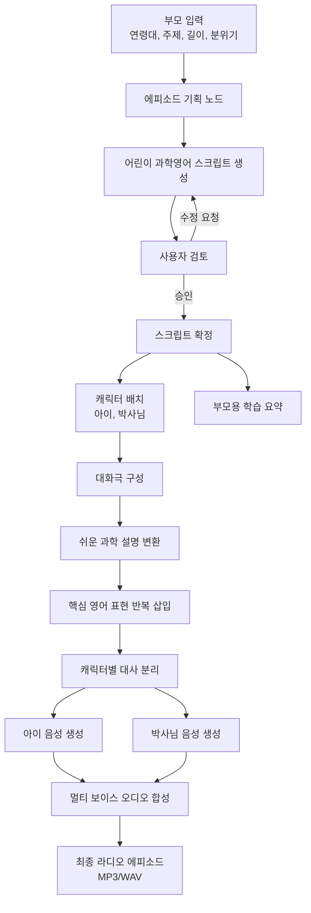

# 어린이 과학영어 라디오 - 리틀사이언스팟

## 목적:
부모가 장거리 이동이나 대기 시간 동안 아이에게 계속 영상만 보여주지 않아도 되도록, 귀로 듣는 과학 영어 콘텐츠를 만들어 주는 교육용 에이전트입니다.
아이가 지루하지 않게 짧은 이야기, 쉬운 과학 개념, 반복 영어 표현, 캐릭터 대화를 섞은 키즈 라디오 스크립트를 만들고, 이를 캐릭터 목소리 오디오 파일로 생성하는 것이 목표입니다.

## 핵심 기능
- 어린이 맞춤 과학영어 스크립트 생성연령대, 주제, 길이, 분위기를 입력받아 라디오 형식 스크립트를 생성합니다.
- 캐릭터 기반 대화형 구성호기심 많은 아이와 설명해 주는 박사님 캐릭터를 자동 배치합니다.
- 단순 설명문이 아니라 대화극처럼 구성해 아이가 더 잘 듣게 합니다.
- 쉬운 과학 + 쉬운 영어 변환어려운 과학 개념을 아이 눈높이로 풀고, 핵심 영어 표현을 반복해서 넣습니다.
- 멀티 보이스 오디오 생성스크립트를 캐릭터별로 나누어 각기 다른 목소리로 연기한 오디오 파일을 만듭니다.
- 최종적으로 하나의 라디오 에피소드로 합칩니다.
- 부모용 학습 요약 제공

그래프 구조

