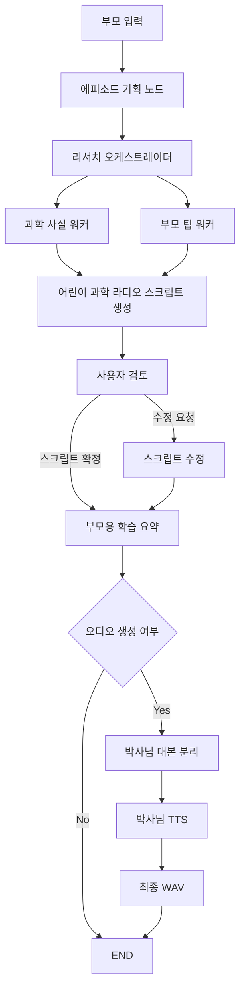

# 어린이 과학 라디오 - 리틀사이언스팟

## 목적:
부모가 장거리 이동이나 대기 시간 동안 아이에게 계속 영상만 보여주지 않아도 되도록, 귀로 듣는 과학 콘텐츠를 만들어 주는 교육용 에이전트입니다.
아이가 지루하지 않게 쉬운 과학 개념을 한국어로 들을 수 있는 어린이 과학 라디오 스크립트와 음성 파일을 만드는 것이 목표입니다.

## 핵심 기능
- 어린이 맞춤 과학 라디오 스크립트 생성: 주제와 길이를 입력받아 라디오 형식 스크립트를 생성합니다.
- 박사님 1인 진행 구성: 설명해 주는 박사님이 전체 에피소드를 혼자 진행합니다.
- 쉬운 과학 설명: 어려운 과학 개념을 한국어로 쉽게 풀어 어린이가 귀로 이해할 수 있게 합니다.
- 단일 보이스 오디오 생성: 박사님 목소리로 전체 에피소드를 하나의 오디오 파일로 생성합니다.
- 최종적으로 하나의 라디오 에피소드로 합칩니다.
- 부모용 학습 요약 제공

## 그래프 구조

### 현상태
- Prompt Chaining: 기획 → 리서치 → 스크립트 → 검토 → 요약 순서로 연결됨
- Parallelization: 리서치 오케스트레이터가 2개의 워커 노드를 병렬로 실행함
- Orchestrator-Workers: 오케스트레이터가 과학 사실, 부모 팁 워커에 작업을 분배함
- Conditional Edge: review_script 이후 승인/수정 요청에 따라 분기함
- Tools: science_fact_tool, parent_tip_tool 연동
- TTS: `OPENAI_API_KEY`와 `ENABLE_TTS=1`이 함께 설정되면 박사님 단일 음성을 생성하고 `outputs/`에 wav 파일을 저장함

## 실행 방법
- `uv run streamlit run main.py`
