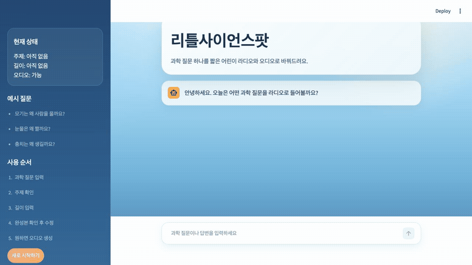
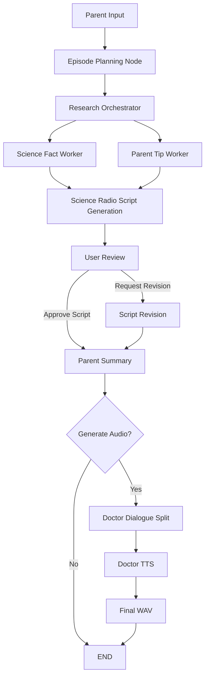

# Little Science Spot

[](https://github.com/hesshess/little-science-pod/actions/workflows/tests.yml)

Little Science Spot is a Streamlit-based educational AI agent that turns a child's
science question into a child-friendly Korean radio episode. It guides the user
through topic confirmation, episode length selection, script review and revision,
and optional text-to-speech generation.

Built with LangGraph and OpenAI APIs, the application combines a routed workflow,
parallel research tasks, input guardrails, and human-in-the-loop approval. The final
approved script is used directly for audio generation so that the written and spoken
episodes stay consistent.

**Key capabilities:** Korean science script generation, user-guided revision,
parent summaries, and optional single-narrator WAV audio.

**Tech stack:** Python 3.13, LangGraph, OpenAI API, Streamlit, and uv.

## Demo



## Example Episode

**Topic:** Why do mosquito bites itch? (`왜 모기가 물면 간지럽나요?`)

This sample pairs a generated, human-reviewed script with audio synthesized from
the exact approved text.

- [Read the complete Korean script](docs/examples/mosquito-itch-script.md)
- [Listen to the narrated episode (MP3, 1:41)](docs/assets/mosquito-itch-example.mp3)

## Configuration

Create a local environment file from the provided template:

```bash
cp .env.example .env
```

| Variable | Required | Default | Purpose |
| --- | --- | --- | --- |
| `OPENAI_API_KEY` | Yes | None | Generates scripts, summaries, revisions, and audio |
| `OPENAI_TEXT_MODEL` | No | `gpt-4.1-mini` | Selects the OpenAI text model |
| `ENABLE_TTS` | No | `0` | Enables TTS when set to `1` |

Never commit `.env` or a real API key. For Streamlit Community Cloud, add the
following TOML in **App settings → Secrets**:

```toml
OPENAI_API_KEY = "your_openai_api_key_here"
OPENAI_TEXT_MODEL = "gpt-4.1-mini"
ENABLE_TTS = "1"
```

Run the application locally:

```bash
uv sync
uv run streamlit run main.py
```

## Graph Structure

```mermaid
graph TD
    A[Parent Input] --> B[Episode Planning Node]
    B --> C[Research Orchestrator]
    C --> D1[Science Fact Worker]
    C --> D2[Parent Tip Worker]
    D1 --> E[Science Radio Script Generation]
    D2 --> E
    E --> F[User Review]
    F -->|Approve Script| G[Parent Summary]
    F -->|Request Revision| H[Script Revision]
    H --> G
    G --> I{Generate Audio?}
    I -->|Yes| J[Doctor Dialogue Split]
    J --> K[Doctor TTS]
    K --> L[Final WAV]
    I -->|No| M[END]
    L --> M
```

### Current Workflow
- Prompt chaining: planning -> research -> script -> review -> summary
- Parallelization: the research orchestrator runs two worker nodes in parallel
- Orchestrator-workers: the orchestrator distributes work to the science fact and parent tip workers
- Conditional edge: the flow branches after `review_script` based on approval or revision request
- Tools: `science_fact_tool` and `parent_tip_tool`
- TTS: when `OPENAI_API_KEY` and `ENABLE_TTS=1` are set, the app generates a single doctor voice track and saves a `.wav` file in `outputs/`

## Run Locally

1. Copy `.env.example` to `.env` and set `OPENAI_API_KEY`.
2. If you want audio generation, set `ENABLE_TTS=1`.
3. Run `uv sync`.
4. Start the app with `uv run streamlit run main.py`.
